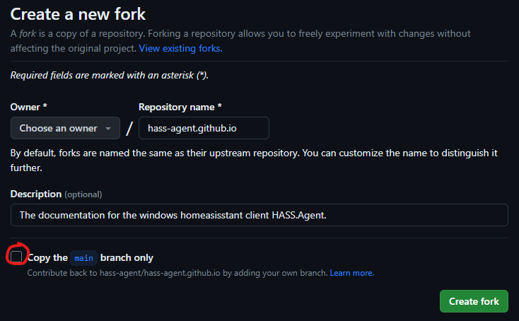

# Setting up a local environment to develop the documentation

!!! note

    You should understand the github structure before attempting this, more info can be found [here](./index.md/#github-structure).

## Forking the repo

To start off you will need to create your own fork of the documentation repo to track your changes. To do this go ahead and navigate to [this](https://github.com/hass-agent/hass-agent.github.io) repo. You will need to create a fork of this repo, a tutorial for this can be found [here](https://docs.github.com/en/get-started/quickstart/fork-a-repo).

### Forking all branches

!!! warning

    Make sure you do this step correctly or you will have problems later on.

After clicking fork you will be presented with this screen. You can customise the repo name and description however you **must** make sure to **de-select** "Copy the `main` branch only". You need both the `main` and `beta` branches to contribute.



### Disabling github actions

You will want to disable github actions so that nothing goes wrong. You can do that in the settings menu like this:

Settings --> Actions / General --> Disable actions --> save

### Deleting `gh-pages` branch

You wil not need the `gh-pages` branch so you can delete it like this.

Select the current branch --> View all branches --> Select the delete icon next to the `gh-pages` branch

## Setting up the local branches

Now you will want to navigate to a directory on your pc for HASS.Agent, I will be using `HASS.Agent`

Now go ahead and create two new folders named `hass-agent-docs-beta` and `hass-agent-docs-main`.

### Clone the branches to each folder

Open a command prompt in the `HASS.Agent` folder and clone your forked repo into the `hass-agent-docs-main` folder. After that clone the `beta` branch of your forked repo into the `hass-agent-docs-beta` folder. You can use the `-b beta` flag for this.

## Setting up virtual environments

Now you will need to repeat the following steps in each of the folders:

???+ warning

    Steps 2 onwards require vscode and the python extension for vscode to be installed.

### Setup venv and vscode

1. run `python -m venv venv` to create a venv environment named venv
2. run `code .` to open the folder in vscode
3. Use ctrl + shift + p to open the command pallette and type in `select interpreter` and press enter. Now select the python located in `.\venv\scripts\python.exe`
4. Use ctrl + , to open the user settings page. Now search for `activate environment` and make sure Python > Terminal: Activate Environment is turned on
5. Open a new terminal in vscode using ctrl + `
6. Verify this terminal contains `(venv)` at the start

???+ note

    After this setup whenever you open vscode to either of these projectsm new terminals will have the venv activated by default. However when re-opening a project vscode's terminal history **does not** activate the venv. So make sure to create a new terminal each time to ensure it's activated. As always you will know it's active when you see `(venv)` at the start.

### Install all requirements

In both of these directories you will need to run:

- `pip install -r requirements.txt`

To install all the dependencies for the documentation.

!!! warning

    Make sure the venv is active before running `pip install` or you will get errors.

## Finishing up

You will now have two separate directories setup on your machine that reflect a fork of the hass.agent docs repo. This will allow you to modify the documentation and test your edits. As well as upload these edits to github and have them reviewed and implemented into the official documentation. The final directory structure will look something like this:

```{.sh .no-copy}
.
└─ HASS.Agent/
   ├─hass-agent-docs-beta/
   └─hass-agent-docs-main/
```
