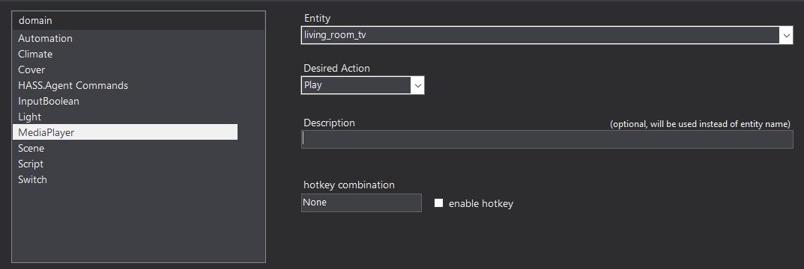
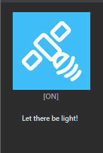

# Getting Started with Quick Actions

After setting up HASS.Agent one of the easisest things to setup is Quick Actions. These are buttons that are available from the taskbar and with a customised hotkey at any time. They can be set to entities or HASS.Agent commands to quickly control elements of your pc or Home Assistant setup.

## Setting up Quick Actions

To setup Quick Actions you will need to open HASS.Agent and Click "Quick Actions", this will open the config section for Quick Actions.

### Creating your first Quick Action

#### Required properties

1. **TYPE:** Select the type of action you want from the left, most of these are types of Home Assistant entities except for the "HASS.Agent Commands".
2. **ENTITY:** Select the entity using the "Entity" selector, this will either be the entity name in HA or the name of the HASS.Agent Command.
3. **ACTION:** Select the action, this can be any of the options listed, it tells HASS.Agent what command the entity should do, for example turn light "on" or "play" on a media player.

???+ example

    Here is the config for a quick action that send the "play" action to my tv.
    

#### Extra config <small>optional</small>

- Add custom description of the action using the description field, this will change the text below the quick action. For example this quick action has the description of "Let there be light!"

??? example "Description of "Let there be light!" "

    

- Add a custom hotkey just for this quick action, allowing you to interact with entities without opening the quick actions menu. To set a custom hotkey tick the "Enable Hotkey" box and click on the "Hotkey Combination" box to set it to whatever you want.

### Changing the Quick Actions Hotkey

You we're asked to assign a custom hotkey to the Quick Actions menu during onboarding, you can change it at anytime from `Configuration > Hotkey`.

## Using your Quick Actions

To use your quick actions all you have to do is open the quick actions menu using either the hotkey you set or right clicking on the tray icon and selecting "Show Quick Actions".

## Further setup

Now that you have a quick action up and running you can read up on the full configuration of Quick Actions found in the [setup](../setup/quick-actions.md) section.

Below are some quick links to getting started guides for the other HASS.Agent features.

- :material-radar: **[Sensors]** – Send data from your computer to homeassistant to create automations!
- :octicons-git-merge-24: **[Commands]** – Create commands homeassistant can run to do things on your computer!
- :material-bell-ring: **[Notifications]** – Send notifications from homeassistant, including actions and images!
- :material-cast: **[Media Player]** – Manage media on your computer and send text to speech!
- :material-file-cog: **[Other Features]** – For a guide on all the features and config options in HASS.Agent.

[Sensors]: ./sensors.md
[Commands]: ./commands.md
[Notifications]: ./notifications.md
[Media Player]: ./media-player.md
[Other Features]: ../setup/index.md
